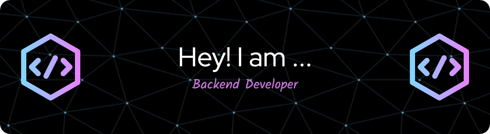

 

  <ul align="center" style="list-style: none">
    

      <h1>
        👋 Hi my name is 
      </h1>
    

  </ul>

**<h3 align="left">Connect with me:</h3>** 

 

 **<h3 align="left">🚀 I’m a Devops / Software Engineer, Java Architect who has turned years of freelancing into a full-time career. Being a back-end allows me to not only develop client-facing apps and websites but also develop it with cutting edge backend support with strong passion for automating and streamlining development, deployment, and infastructure management.

I specialize in spring boot, testing and software development, designing ci-cd pipelines, managing cloud-native architectures using tools like docker and kubernetes, and implementing infastructure as code using Terraform and Ansible. I love designing systems that are light yet powerful, distributed yet synchronized and beautiful yet effective. I also frequently blog about the world behind the screen which involves system designs, databases, security, servers, optimisation and also promising technologies like Blockchain and PWAs.</h3>**

**<h3 align="left">Rapid Fire</h3>**

- 💼 I'm currently working on: **💻 Oauth2 Security & Spring Ai**
- 🌱 I'm currently learning: **☕ Java**, **🐍 Python**, **🐹 GoLang**
- 💬 Ask me about: **💡 Java, SpringBoot, Docker, Kubernetes, Oauth2 Security and REST APIs**
- ⚡ Fun fact: **🚆 I once debugged a issue i thought i never could all by myself without the help of Ai**

 **<h3 align="left">Skills</h3>**

  <!-- Java & Spring -->
  
  
  

  <!-- Containers -->
  
  

  <!-- Languages -->
  
  
  
  

  <!-- Frameworks -->
  
  

  <!-- Databases -->
  
  

  <!-- APIs -->
  

 **<h3 align="left">GitHub Stats</h3>**

  
    

  

  

